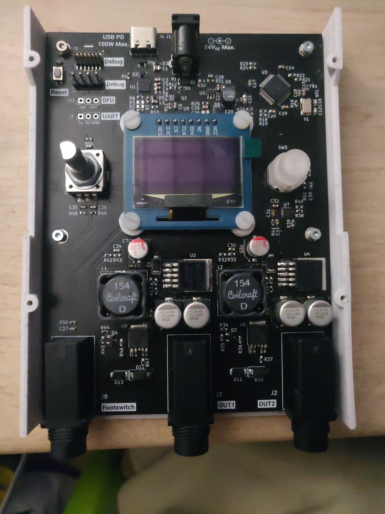
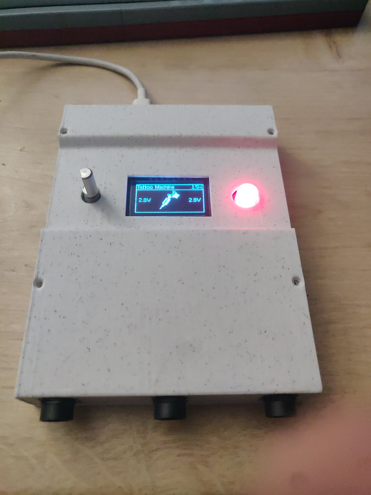

# Tattoo Power Supply Hardware

 

    

This is an open source project for a tattoo power supply circuit board. The circuit board is designed to provide power to tattoo machines, allowing artists to control the voltage and frequency of their machines for precise and consistent results.

# Features

- Dual channel power supply
- Each channel can provide up to 20V and 3A
- 1 footswitch input and 1 handswitch input
- Adjustable voltage and frequency controls
- Compatible with most tattoo machines
- OLED display for easy monitoring of voltage and frequency
- Overload protection for safety
- USB-C Power Delivery up to 100W
- DC Jack input up to 24V

# Getting Started

## PCB

To get started with this project, you will need at least KiCAD 7. You can download KiCAD from the [KiCAD website](https://kicad.org/). You will find gerber files in each release, which you can use to order PCBs from a PCB manufacturer. Every files will be available in the PCB folder. For components, you can use the BOM file to order them from a distributor `Tattoo_Supply_bom_Vx.x.csv`.

## Case

    

The case is designed with FreeCAD. In `Case` folder, you will find `.FCStd` files which are source files for FreeCAD and `.3mf` files which are 3D printer ready. The shapes of the case are very simple, if you're 3D designer, make it prettier !

# License

This project is licensed under the CERN Open Hardware Licence Version 2 - Permissive. See the LICENSE file for more information.

# Contact

If you have any questions or feedback about this project, please feel free to contact the project maintainer in issue section.
